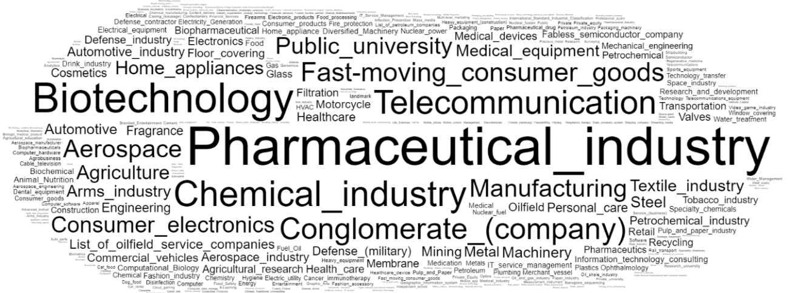

**Questões de Competência Ontologia de Patentes**

\_\_\_\_\_\_\_\_\_\_\_\_\_\_\_\_\_\_\_\_\_\_\_\_\_\_\_\_\_\_\_\_\_\_\_\_\_\_\_\_\_\_\_\_\_\_\_\_\_\_\_\_\_\_\_\_\_\_\_\_\_\_\_\_\_\_\_\_

Questões de competência avaliadas:

- Em quais anos foram depositadas mais patentes?
- Quais instituições registram mais patentes?
- Em quais áreas tecnológicas são produzidas mais patentes?
- Qual a classificação científica de uma patente?
- As universidades que mais contribuem com a produção tecnológica?
- Qual a nacionalidade das empresas que registram patentes no Brasil?

\_\_\_\_\_\_\_\_\_\_\_\_\_\_\_\_\_\_\_\_\_\_\_\_\_\_\_\_\_\_\_\_\_\_\_\_\_\_\_\_\_\_\_\_\_\_\_\_\_\_\_\_\_\_\_\_\_\_\_\_\_\_\_\_\_\_\_\_

- **Em quais anos foram depositadas mais patentes?**

Usaremos a query em SPARQL abaixo para criar um ranking de patentes por ano:

|
prefix pat: <http://us.patents.aksw.org/ontology/>

PREFIX rdf: <http://www.w3.org/1999/02/22-rdf-syntax-ns#>

PREFIX dbo: <http://dbpedia.org/ontology/>

SELECT ?year (count(?year) as ?patentsInYear)

WHERE {

`  `?patent rdf:type pat:Patent;

`  		  `dbo:year ?year.

}

group by(?year)

order by desc (?year)

|
| :- |
Repare que selecionamos na variável ?patent todos recursos do tipo patente. Na linha seguinte, tomamos a propriedade dbo:year da patente. Por fim, criamos um agrupamento sobre a variável year para que possamos fazer uma função de agregação que conte o número de patentes por ano. O resultado da query permite construir uma linha temporal de registros de patentes.

- **Em quais áreas tecnológicas são produzidas mais patentes?**

A agregação para criar um ranking de áreas tecnológicas usa os mesmos recursos das queries em SPARQL para a criação do ranking de patentes por ano. A principal diferença é que consultamos pela propriedade patProp:international-classification na ontologia de patentes.

|
prefix pat: <http://us.patents.aksw.org/ontology/>

prefix patProp: <http://us.patents.aksw.org/property/>

PREFIX rdf: <http://www.w3.org/1999/02/22-rdf-syntax-ns#>

SELECT ?section (count(?section) as ?sectionNumber)

WHERE {

`  `?patent rdf:type pat:Patent;

`  		  `patProp:international-classification ?ipc.

`  `?ipc patProp:ipcSection ?section.

}

group by(?section)
|
| :- |

- **Quais instituições mais registram patentes?**

Tome a propriedade patProp:applicant de uma patente. Agregue a contagem sobre o *applicant* e realize a contagem de patentes por *applicants*. É importante notar que é importante acrescentar a operação *order by desc* para visualizar os proprietários de patentes em ordem decrescente.

|
prefix patProp: <http://us.patents.aksw.org/property/>

PREFIX rdf: <http://www.w3.org/1999/02/22-rdf-syntax-ns#>

SELECT ?applicant (count(?applicant) as ?numberOfPatents)

WHERE {

`  `?patent rdf:type pat:Patent;

`  		  `patProp:applicant ?applicant.

}

group by(?applicant)

order by desc(?numberOfPatents)
|
| :- |

O resultado terá o seguinte formato:

- **Quais setores da indústria mais contribuem na produção de propriedade intelectual?**

Tome a mesma tabela de requerentes de patentes com entidades do dbpedia. Usamos a query abaixo para determinar os setores da indústria em que esses requerentes atuam.

|PREFIX rdf: <http://www.w3.org/1999/02/22-rdf-syntax-ns#>            PREFIX dbo: <http://dbpedia.org/ontology/>  select ?company ?industry where{ `  `?company rdf:type dbo:Company; `  		 `dbo:industry ?industry; }|
| :- |
Usamos essas informações para construir uma nuvem de palavras que representa a influência dos setores da indústria na produção de propriedade intelectual no Brasil.

**
Figura 15: Setores de atuação dos requerentes de patentes no Brasil.

O tamanho de uma palavra na nuvem é proporcional ao número de aplicações de patentes possuídas pelo setor. Indústria Farmacêutica, Biotecnologia e Química têm o maior destaque na produção brasileira.

- **Qual a nacionalidade das empresas que registram patentes no Brasil?**

Analisamos a influência dos países na produção da propriedade intelectual brasileira. Para isso, buscamos determinar a nacionalidade das empresas que detém títulos de patentes no país. 

|
prefix patProp: <http://us.patents.aksw.org/property/>

PREFIX rdf: <http://www.w3.org/1999/02/22-rdf-syntax-ns#>

PREFIX dbo: <http://dbpedia.org/ontology/>

SELECT ?patent ?applicant

WHERE {

`  `?patent rdf:type pat:Patent;

`  		  `patProp:applicant ?applicant.

`  `filter(regex(str(?applicant),"dbpedia"))

}
|
| :- |

A consulta acima em SPARQL retorna as entidades que representam requerentes de patentes e são determinadas por entidades da base de dados do dbpedia.

|
PREFIX rdf: <http://www.w3.org/1999/02/22-rdf-syntax-ns#>           

PREFIX rdfs: <http://www.w3.org/2000/01/rdf-schema#>

PREFIX dbo: <http://dbpedia.org/ontology/>

select ?company ?label ?country

where{

`  `?company rdf:type dbo:Company;

`  		 `rdfs:label ?label.

`   `{

`     `?company dbo:country ?country.

`   `}UNION{

`     `?company dbp:locationCountry ?country.

`   `}UNION{

`     `?company dbo:regionServed ?country.

`   `}UNION{

`     `?company dbp:hqLocationCountry ?country.

`   `}UNION{

`     `?company dbo:location ?country.

`   `}

`  `FILTER((lang(?label) = 'en' || lang(?label) = 'pt'))

}
|
| :- |
`	`Essa outra query, realizada no dbpedia, retorna as informações das empresas associadas aos países de origem em formato tabular. A determinação da nacionalidade de um requerente de patente se dá por meio da operação *inner join* entre a coluna *applicant* da tabela resultante da primeira query e a coluna *company* da outra tabela.

Para realizar o mapeamento da nacionalidade dos requerentes de patentes, utilizamos a ferramenta Google GeoChart* [7] para construção de mapas:

Figura 14: Mapa de influência de outros países na produção de propriedade intelectual brasileira. Fonte: Arquivo Próprio.

A figura 14 mostra que as empresas de outros países que registram títulos de propriedade intelectual no Brasil são em suma maioria norte-americanas. Também verifica-se que alguns países europeus e asiáticos têm certa influência na produção de propriedade intelectual brasileira. A relevância das empresas brasileiras é subestimada a partir desse método, pois somente grandes empresas têm entidades representadas no wikipedia e por consequência no dbpedia. Contudo, o comparativo entre os demais países se comporta muito bem, pois as empresas de outros países que registram títulos no Brasil tendem a serem de grande porte.

De acordo com a confederação nacional da indústria, somente em 2018, foram depositados cerca de 200 mil pedidos no INPI. Sendo que a maioria dos depositantes (86%) eram do Brasil. Outros 4% foram dos Estados Unidos. Alemanha, França, China e Reino Unido tiveram participação de 1%, cada.

